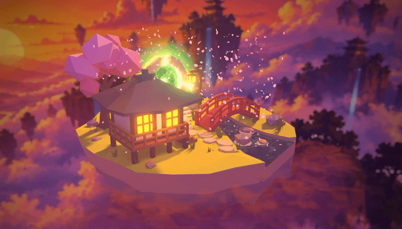

# Japanese Floating Island Diorama — Three.js & WebGL

[](https://threejs.org/)
[](https://www.khronos.org/webgl/)
[](https://www.blender.org/)
[](https://vite.dev/)



**[▶ Live demo](https://cesartevisual.github.io/threejs-japanese-floating-diorama/)**

A small **Japanese-style floating island diorama** with a glowing portal, modeled in **Blender** and rendered in the browser with **Three.js** and **WebGL**. It covers the whole pipeline: baked lighting, a glTF/Draco export, custom **GLSL shaders**, cherry blossom **particles**, stylized water and clouds, and **bloom post-processing**.

This project is **an exploration, not a finished product**. Each part of the scene was a chance to learn the basics of one step in a 3D pipeline, from modeling in Blender to shading and post-processing in the browser. It's shared openly so that:

- **Collaborators** can follow how the scene is put together and pick up any part of it.
- **Anyone learning** can use it as inspiration or a reference, take it apart, and reuse whatever helps.

Nothing here claims to be the "right" way. It's a record of figuring these processes out for the first time.

## What this project explores

| Process | What was explored | Where to look |
| --- | --- | --- |
| **Modeling** | Blocking out and building the island, house, bridge, portal and props in Blender | `static/japanese_portal_diorama/` |
| **UV unwrapping** | Unwrapping meshes so they can take a baked texture, and packing extra data into UVs (for example, distance to the riverbank for the water shader) | Water and stream sections in `src/script.js` |
| **Baking** | Baking lighting and shadows from Blender into one texture, so the browser shows the lighting without calculating it | `static/japanese_portal_diorama/bake_diorama_combined_4096_filmic.png` |
| **Rendering the bake** | Rendering the bake in Blender with Filmic color management, then matching it in Three.js | "Model" and "Sunset grade" sections |
| **Denoising** | Cleaning up a noisy bake so it can use fewer samples and still look smooth | Done in Blender before export |
| **Exporting custom glTF** | Splitting the scene into separate glTF/GLB files (main model, emissions, water, underside, stream) and compressing them with Draco | `static/japanese_portal_diorama/`, `static/draco/` |
| **Emissive materials** | Lanterns, windows and the portal with color values above 1 so the bloom picks them up | "Lights (emissive surfaces)" and "Portal" sections |
| **Particles** | Falling cherry blossom petals, plus sparks and lightning arcs around the portal | "Petals" and "Portal energy" sections |
| **Clouds** | Soft, smoky mist wrapping the underside of the island, using a depth pass to blend it with the rock | "Clouds" section |
| **Refraction** | The water in the stream, seen through the cliff edge, with depth and shoreline data baked in Blender | "Water" and "Stream mouth" sections |
| **Post-processing** | Bloom, anti-aliasing (SMAA) and a final output pass on top of the render | "Post processing" section |

Nearly all the scene code is in `src/script.js`, split into commented sections (`/** Section name */`), so you can jump straight to the process you're interested in. A [lil-gui](https://lil-gui.georgealways.com/) panel lets you adjust most parameters live in the browser.

## Running it locally

You need [Node.js](https://nodejs.org/en/download/).

```bash
# Install dependencies (only the first time)
npm install

# Start the local dev server (Vite prints the URL, usually http://localhost:5173)
npm run dev

# Build for production into dist/
npm run build
```

## Project structure

```
src/
  index.html      Page markup, loading screen, credit link
  style.css       Canvas, loader and credit styles
  script.js       The whole scene: loaders, shaders, particles, post-processing
static/
  japanese_portal_diorama/   Exported glTF/GLB models and the baked texture
  draco/                     Draco decoder for compressed geometry
  backdrop.jpg               Sunset sky backdrop
  og-image.jpg               1200×630 image for link previews (Open Graph)
  social-preview.gif         Animated 640×320 GitHub social preview
  robots.txt, sitemap.xml    Search engine crawl hints for the live demo
docs/
  diorama.gif                README preview
```

## Learning from it

Feel free to fork it, break it and rebuild it. Some good places to start:

1. Turn off the post-processing passes to see how much of the look comes from bloom.
2. Swap the baked texture for a plain color to see what baking adds.
3. Change the particle counts and speeds in the GUI to see how the petals and sparks behave.

If you learn something new or find a better approach, contributions and suggestions are welcome.
